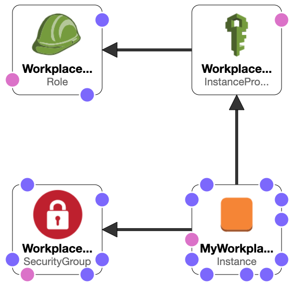

# Workplace app

> :warning: **Disclaimer**: This application is for demonstration/learning purposes as part of my personal portfolio. Do not use it in production.

## Overview
This is a prototype of a simple content management application for company departments to store their documents and images.

The main features are:
* AWS S3 as the backend for storing the files
* Enhanced security:
    * Role-based access control (aka RBAC)
    * User registration
    * Admin panel
* Files reporting
* CRUD for project
* CRUD for files

## Design
The main design aspects of this web application are:
* [Python 3](https://www.python.org/about/gettingstarted/) as the programming language
* [Flask](https://flask.palletsprojects.com/en/2.0.x/) as the web development framework
* [AWS S3](https://aws.amazon.com/s3/) is used store the files
* [AWS Boto3 SDK](https://aws.amazon.com/sdk-for-python/) for integration with AWS S3

The Flask application runs with the WSGI [Gunicorn](https://gunicorn.org/) for better compatibility and scalability on production. It is configured for listening on 127.0.0.1:8080 (localhost:8080). When running the application locally for development/testing purposes this is okay.

When the application is deployed in "production", it is recommended to place the application behind a load balancer or reverse proxy. In this case, Nginx is used as a reverse proxy to publish the application on port 80.

The application can be deployed locally or natively in AWS.

When the application is deployed on AWS using the included CloudFormation template, Nginx is deployed as part of the bootstrapping with user-data, presenting the application to the external world on port 80, and redirecting the requests to the application running with Gunicorn on localhost:8080. 

With first run, application creates database with default departments (Human Resources, Product Development and Quality Assurance), as well as users with roles admin (/admin) & end-user.

To test the application, log in with the provided emails and passwords:
* Role: admin
  * Username: admin@example.com
  * Password: password
* Role: user
  * Username: user@example.com
  * Password: 1234

## Deployment Methods

### Local Deployment

Before you try the application, make sure to check the prerequisites.

Prerequisites:

* You have Python 3 installed
* For AWS you will need:
  * AWS Account with AmazonS3FullAccess policy
  * AWS_ACCESS_KEY_ID
  * AWS_SECRET_ACCESS_KEY

1. Clone this repository and move into it
    ```shell
    git clone https://github.com/zuzanakorma/workplace-app-aws.git
    cd workplace-app-aws
    ```

2. Create .env file with environmental variables:

    Mandatory
    ```ini
    AWS_ACCESS_KEY_ID="your_aws_access_key"
    AWS_SECRET_ACCESS_KEY="your_aws_secret_key"
    AWS_REGION="your_aws_region"
    ```

    Optional
    ```ini
    # Flask
    SECRET_KEY="your_super_secret_key" # Used for securely signing the session cookie. Default: Auto-generated

    # Flask-SQLAlchemy. More details https://flask-sqlalchemy.palletsprojects.com/en/2.x/config/
    SQLALCHEMY_DATABASE_URI="sqlite:///site.db" # Path for the application database. Default: site.db

    # Flask-Security. More details https://pythonhosted.org/Flask-Security/configuration.html
    SECURITY_PASSWORD_HASH="pbkdf2_sha512" # Default: pbkdf2_sha512
    SECURITY_PASSWORD_SALT="your_super_secret_salt_password" # Default: yourVerySecureSatlPassword
    SECURITY_USER_IDENTITY_ATTRIBUTES="email" # Default: email

    # Flask-Mail. More details https://pythonhosted.org/Flask-Mail/
    # The application only supports Gmail accounts at this time
    EMAIL_USERNAME="fake@gmail.com"
    EMAIL_PASSWORD="securepassword"
    ```

3. Create a Python virtual environment and install requirements

    ```shell
    python3 -m venv venv
    source venv/bin/activate
    pip install -r requirements.txt
    ```

4. Run the application

    * Using Flask WSGI. Recommended for development/testing to debug possible issues

        ```shell
        python run.py
        ```
    * Using Gunicorn WSGI. Recommended for production

        ```shell
        gunicorn -b localhost:8080 run:app
        ```

5. [Open the application](http://localhost:8080)

### AWS Deployment 

This deployment method is fully automated end-to-end using AWS CloudFormation. From the bootstrapping of the EC2 instance using `user-data.sh`, to the creation of the different AWS resources.

The user-data is decoupled from the CloudFormation template for flexibility and reusability purposes. We are passing user-data (as a file) to perform common automated configuration tasks, and even fully install the web application. You don't need to worry about this file, it's all scripted for you :smile:. The `user-data.sh` script includes:
* Install git client (not included with Amazon Linux 2)
* Clone application repository
* Create Python virtual environment and install requirements
* Create, enable, and start systemd service for Gunicorn so the application automatically starts in the event of EC2 restart
* Install NGINX (nginx1 for Amazon Linux)
* Configure NGINX reverse proxy for the Flask application (0.0.0.0:80-->127.0.0.1:8080)
* Enable and start NGINX using systemd service

The included CloudFormation template, `cf-ec2-sg.yaml`, creates a stack with the following resources:

* EC2 Instance (t2.micro) in default AZ *eu-central-1b* with Amazon Linux 2 AMI
* Security Group to allow SSH (port 22), HTTP (port 80) from **anywhere**
* IAM Role with managed policies AmazonS3FullAccess and AmazonSSMReadOnlyAccess and trust relationship (sts:AssumeRole) for EC2 instance
* Instance Profile 




Before you try the application, make sure to check the prerequisites.

Prerequisites:

* AWS Account with AWSCloudFormationFullAccess 
* AWS CLI
* Key Pair for EC2 Instance (default region in application is eu-central-1)

To interact with AWS you need to configure [AWS CLI](https://docs.aws.amazon.com/cli/latest/userguide/cli-chap-configure.html)

```shell
aws configure
```
You will have to provide:
```ini
AWS_ACCESS_KEY_ID
AWS_SECRET_ACCESS_KEY
AWS_REGION
```

1. Clone this repository and move into it
    ```shell
    git clone https://github.com/zuzanakorma/workplace-app-aws.git
    cd workplace-app-aws
    ```
2. Launch CloudFormation Stack. The command requires certain parameters such as:

    Mandatory:
   * ParameterKey=KeyName,ParameterValue=`Your_SSH_Key_Name`
   * ParameterKey=UserData,ParameterValue=$(base64 `user-data.sh`). Do not change the value.

    Optional:
   * ParameterKey=AvailabilityZone,ParameterValue=`Your_AWS_AZ`. Default: eu-central-1b
   * ParameterKey=ImageId,ParameterValue=`AWS_Linux_2_AMI_ID_For_AZ`. Default: ami-0dcc0ebde7b2e00db

    ```shell
    aws cloudformation create-stack \
    --stack-name myStack \
    --template-body file://cf-ec2-sg.yaml \
    --parameters ParameterKey=KeyName,ParameterValue=KeyTest \
    ParameterKey=UserData,ParameterValue=$(base64 user-data.sh) \
    --capabilities CAPABILITY_NAMED_IAM 
    ```

3. Monitor the completion of the CloudFormation stack in AWS. After completion, gather the public DNS Name from the stack output tab and open it in a browser.
 

